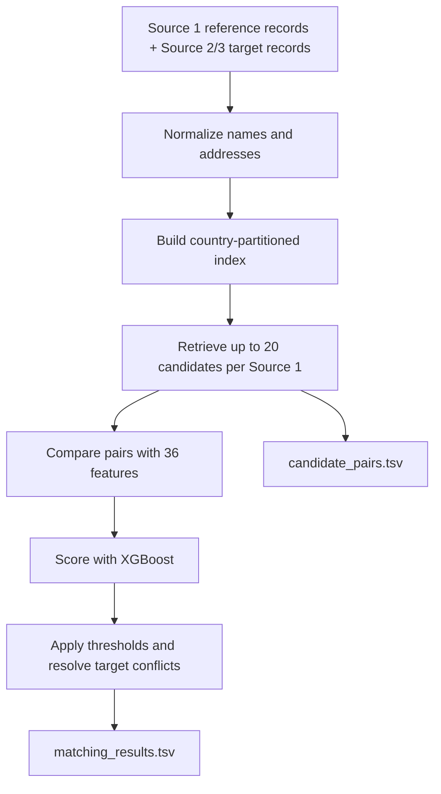

# Amazon ML Challenge 2026: Business Entity Resolution

**Team Name:** MahaRudra  
**Team Members:** Saksham Chaudhari, Akash Bhuyan, Rahul Atkare, Rushi Kedar  
**Submission Date:** 02 October 2026  

---

## 1. Summary

This solution links each Source 1 business to matching records in Sources 2 and 3. It first finds likely candidates, then scores them with a trained model. The design prioritizes precision because incorrect links are costly under the challenge's macro $F_{0.5}$ metric.

On the saved validation set, macro $F_{0.5}$ was **0.9408**, with **99.14% precision**, **86.77% recall**, and **95.28% candidate recall**. The team-reported public leaderboard result is approximately **0.827**; the exact portal value is not saved locally. These are different evaluations.

---

## 2. Methodology

### 2.1 The Task

For each Source 1 record, return every matching Source 2 or Source 3 ID. A record can have no matches; in that case, its output list must be empty. Names and addresses may be incomplete or differ in spelling, punctuation, script, abbreviations, and word order. Test data includes a country not seen in training, so country values are not hard-coded.

### 2.2 The Matching Process



Each Source 1 record has one row in the matching output. Its match list is empty when no target passes the decision rules.

---

## 3. Candidate Generation

The pipeline uses an inverted index to avoid comparing every Source 1 record with every target record. It retrieves targets that share useful name or address keys, removes overly common keys, and ranks candidates by shared-key count. The model scores at most 20 candidates per Source 1 record.

On validation, **95.28% of true links were present in the candidate set**. A true match missed at this stage cannot be recovered by the model. The test run generated 34,461,015 candidate pairs.

---

## 4. Matching Model

The model uses **36 features** to compare names, addresses, and address numbers. Examples include name similarity, shared address tokens, matching or conflicting street numbers, and how many candidate keys the pair shares. Training uses known matches plus difficult non-matching candidates that look similar.

The saved model is XGBoost configured for GPU use. On validation, the selected match thresholds were 0.70 for Source 2 and 0.75 for Source 3. Inference also reduces confidence for conflicting address numbers and prevents a target ID from being assigned to multiple Source 1 records.

---

## 5. Results

The validation results below are from the saved report. They cover 10,000 held-out Source 1 entities.

| Metric | Result |
| :--- | ---: |
| Macro $F_{0.5}$ | **0.9407647** |
| Precision | 0.9913620 (99.14%) |
| Recall | 0.8676670 (86.77%) |
| Candidate recall | 0.9527918 (95.28%) |
| Singleton accuracy | 0.9796673 (97.97%) |
| False positives | 262 |
| False negatives | 4,586 |

The team-reported public leaderboard score is approximately **0.827**; the exact portal value is not stored locally. It is measured on a different set from the validation results above.

Typical errors are false matches between businesses with similar names or addresses, and missed links where both fields are incomplete or heavily changed. Blocking also limits recall because matches not retrieved as candidates cannot be scored.

---

## 6. Reproduction and Submission

### Required Archive Layout

The requested archive layout is:

```text
<team_name>_submission.zip
├── output/
│   ├── matching_results.tsv
│   └── candidate_pairs.tsv
├── code/
│   └── business_entity_resolution/
│       ├── src/
│       ├── README.md
│       └── requirements.txt
└── Documentation_template.md
```

The two required TSVs, the source directory, its README, and its requirements file are present in the current workspace. The pipeline is not yet reproducible from only `code/business_entity_resolution/`: test and training data, the saved model and metadata, `train.py`, and the validator are stored elsewhere in the repository. In addition, the pinned requirements file does not include XGBoost, which is required by the selected model. This documentation-only change does not alter code, dependencies, data, or model artifacts.

### Run From The Repository Root

From the repository root, inference with the existing model and root-level test files is invoked as:

```bash
python code/business_entity_resolution/src/main.py --test-dir . --model-path models/final_entity_matcher.joblib --meta-path models/model_metadata.json --output-dir output
```

Training is launched by the root-level script, not by a script inside the package:

```bash
python train.py --train-dir . --model-type xgboost_gpu
```

The saved model uses XGBoost GPU; the selected execution mode requires a compatible XGBoost installation and CUDA-enabled NVIDIA environment. Replace the approximate public leaderboard score in this document with the exact value shown in the competition portal before final submission.
