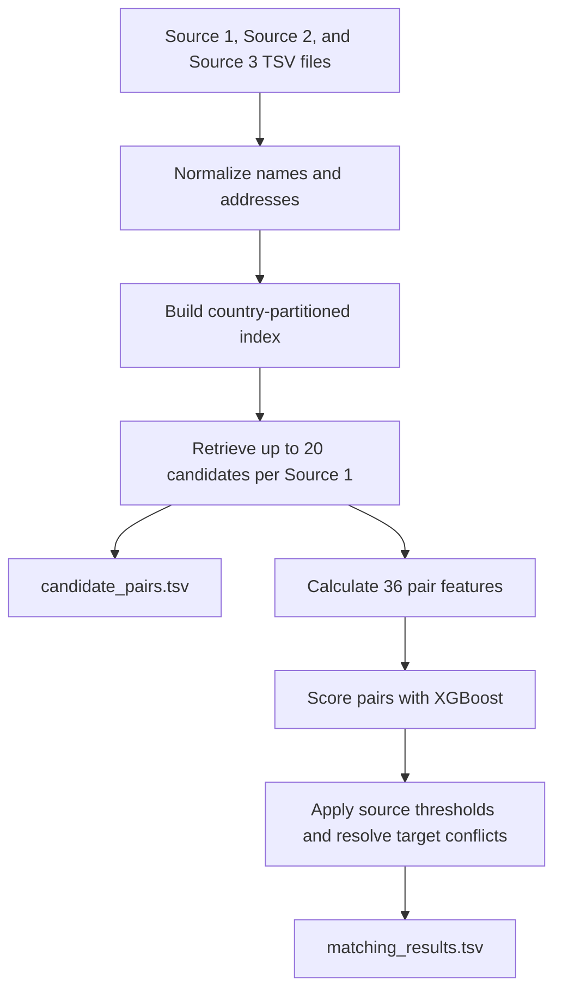

# Amazon ML Challenge 2026: Business Entity Resolution

This project matches business records across three data sources. For each Source 1 record, it predicts matching Source 2 and Source 3 IDs. The pipeline uses name/address normalization, candidate generation, a trained classifier, and confidence thresholds.

## At A Glance

- **Validation macro $F_{0.5}$:** 0.9407647 (saved held-out validation report)
- **Public leaderboard score:** approximately 0.827 (team-reported; confirm the exact portal score)
- **Candidate recall:** 95.28% on validation
- **Test run:** 1,732,544 Source 1 records and 34,461,015 candidate pairs
- **Outputs:** `output/matching_results.tsv` and `output/candidate_pairs.tsv`
- **Model:** XGBoost GPU, 36 features, thresholds 0.70 for Source 2 and 0.75 for Source 3

Validation and leaderboard scores are from different evaluations and should not be compared as if they were the same measurement.

## Contents

- [Task and approach](#task-and-approach)
- [Evaluation results](#evaluation-results)
- [Files and layout](#files-and-layout)
- [Reproduce the run](#reproduce-the-run)
- [Authors](#authors)

---

## Task and Approach

The task is to find all Source 2 and Source 3 records that refer to the same real-world business as a Source 1 record. A Source 1 record may have no matches, one match, or several matches. Names and addresses can be incomplete or differ in spelling, script, abbreviations, and word order. The test data also contains a country not seen in training, so the pipeline treats country as an open set.

The evaluation metric is macro-averaged $F_{0.5}$. It scores each Source 1 record separately, including singletons, then averages the scores. Precision is weighted more heavily than recall, so an incorrect link is especially costly:

$$F_{0.5} = \frac{1.25 \cdot P \cdot R}{0.25 \cdot P + R}$$

---

## Pipeline

The diagram shows how input records become the two submission files:



Each Source 1 entity receives one output row. If no target passes the matching rules, its match list is empty.

---

## Candidate Generation

Comparing every reference record with every target record would be too expensive. Instead, the pipeline builds an inverted index and retrieves candidates that share useful name or address signals. Keys include normalized name fragments, name tokens, address words, and address numbers. Very common keys are removed to reduce noise, and candidates are ranked by the number of shared keys.

At inference, the pipeline keeps up to **20 candidates per Source 1 record**. The saved validation report shows **95.28% candidate recall**, meaning this fraction of true links was present before model scoring.

---

## Features and Matching

For each candidate pair, the system compares the normalized business names and addresses. The **36 features** cover name similarity, address similarity, numeric address agreement or conflict, missing-address cases, source identity, and how many blocking keys the pair shares. The classifier scores each pair; validation-selected thresholds are **0.70 for Source 2** and **0.75 for Source 3**. If target records conflict between Source 1 entities, the highest-scoring assignment is retained.

---

## Evaluation Results

| Evaluation | Macro $F_{0.5}$ | Precision | Recall | Notes |
| :--- | ---: | ---: | ---: | :--- |
| Held-out validation | **0.9407647** | 99.14% | 86.77% | 10,000 Source 1 records; local saved report |
| Public leaderboard | **about 0.827** | Not available | Not available | Team-reported; confirm exact portal score |

Validation also recorded 95.28% candidate recall, 97.97% singleton accuracy, 262 false positives, and 4,586 false negatives. The validation and leaderboard values come from different evaluation sets.

---

## Files and Layout

```text
.
├── code/business_entity_resolution/   # Pipeline source and reproduction guide
├── experiments/                       # Held-out validation ID list
├── models/                            # Trained model and metadata
├── output/                            # Reports; TSV outputs are generated here
├── utils/validate_submission.py       # Submission-format validator
├── train.py                           # Training and validation entry point
├── Documentation_template.md          # Methodology for the evaluator
└── README.md
```

The training and test TSV data files are expected in the repository root but are excluded from GitHub by `.gitignore`. The generated `matching_results.tsv` and `candidate_pairs.tsv` are also ignored. Provide the challenge data locally to reproduce the run; do not assume those TSV files are included in this GitHub repository.

---

## Install Dependencies

Run these commands from the repository root. The current requirements file does not include XGBoost, which is needed by the saved model:

```bash
python -m venv .venv
# Windows PowerShell
.venv\Scripts\Activate.ps1
# macOS/Linux
source .venv/bin/activate
pip install -r code/business_entity_resolution/requirements.txt
pip install xgboost
```

---

## Reproduce and Validate

Put the seven challenge TSV inputs in the repository root: three training sources, `train_ground_truth.tsv`, and three test sources. The trained model and its metadata are already under `models/`.

From the repository root, generate predictions and the candidate set:

```bash
python code/business_entity_resolution/src/main.py --test-dir . --output-dir output
```

This creates `output/matching_results.tsv` and `output/candidate_pairs.tsv`. To retrain instead, use:

```bash
python train.py --train-dir . --model-type xgboost_gpu
```

The saved model uses GPU-backed XGBoost and requires a compatible NVIDIA/CUDA environment. Validate the generated files with:

```bash
python utils/validate_submission.py --matching output/matching_results.tsv --candidate output/candidate_pairs.tsv --test-dir .
```

The validator checks file structure and IDs; it does not calculate the leaderboard score. The TSV inputs and outputs are excluded from this repository by `.gitignore`, so they must be present locally when reproducing or validating.

---

## Submission Notes

- The matching file must contain one row for every Source 1 test ID. Leave its match list empty for predicted singletons.
- Candidate IDs in `candidate_pairs.tsv` should include every final match.
- The competition archive requires a self-contained pipeline folder. In this repository, data, model files, training script, and validator are outside `code/business_entity_resolution/`; copy the required assets into the archive before claiming it is independently reproducible.
- No external business registry or lookup service is used.

---

## Authors
- **Saksham Chaudhari** ([@saksham1326](https://github.com/saksham1326))
- **Akash Bhuyan** ([@AB-1817](https://github.com/AB-1817))
- **Rahul Atkare** ([@mystio1](https://github.com/mystio1))
- **Rushi Kedar** ([@Rushi9234](https://github.com/Rushi9234))
